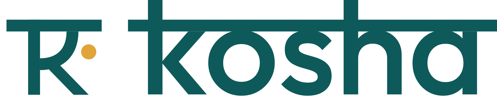

<h1>
  <picture>
    <source media="(prefers-color-scheme: dark)" srcset="static/img/logo-light.svg">
    
  </picture>
</h1>

A Django web app for personal finance.

## Requirements

- Python 3.14+
- [uv](https://docs.astral.sh/uv/)

## Setup

```sh
uv sync
uv run prek install
cp .env.example .env  # then set SECRET_KEY; see comments in the file
uv run manage.py migrate
uv run manage.py runserver
```

## Docker

Development: runserver with autoreload plus a Tailwind watcher, both over the
bind-mounted working tree. Dependencies and migrations are applied on start.

```sh
cp .env.example .env  # then set SECRET_KEY
docker compose up
```

Production: gunicorn on a read-only image with compiled assets, published on
`127.0.0.1` for a reverse proxy that terminates TLS. SQLite lives on the
`kosha-data` volume unless `DATABASE_URL` says otherwise.

```sh
docker compose -f compose.prod.yaml up -d --build
```

## Linting

```sh
uv run ruff check
uv run ruff format
```

## License

[MIT](LICENSE)
